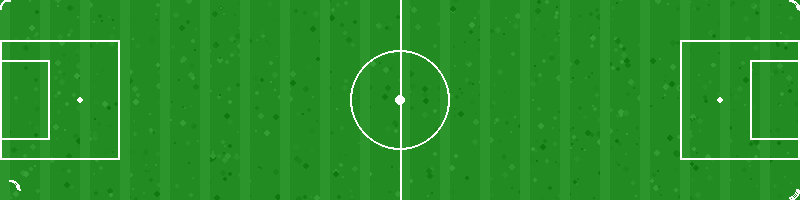

# Head Football Game

A single-player Head Football-style game built with Python and Pygame. Play against an AI opponent with different difficulty levels and player characters.



## Features

- **Single-player gameplay** against AI opponent with three difficulty levels
- **Multiple player characters** with different stats (speed, jump power, heading power, control)
- **Realistic physics** for ball movement and player interactions
- **Goal celebrations** with confetti effects
- **Scoring system** with visual feedback
- **Simple and intuitive controls**
- **Customizable gameplay** with different characters and difficulty settings

## Installation

1. Clone this repository or download the source code
2. Create a virtual environment:
   ```bash
   python -m venv venv
   source venv/bin/activate  # Windows: venv\Scripts\activate
   ```
3. Install the required packages:
   ```bash
   pip install pygame
   ```

## How to Play

Run the game:
```bash
python main.py
```

### Controls

- **Left/Right Arrow Keys**: Move your player (press-based movement)
- **Space**: Jump
- **Up Arrow**: Head the ball

### Game Rules

- Score goals by heading the ball into your opponent's goal
- Each goal scores 1 point
- The game ends when the timer runs out or when a player reaches the maximum score (5 goals)
- The player with the most goals wins

## Player Characters

Each player character has different stats:
- **Speedy**: High speed, good jump, moderate power and control
- **Powerful**: High power, moderate speed, jump and control
- **Balanced**: Good all-around stats
- **Technical**: High control, good speed, moderate jump and power
- **Jumper**: High jump, moderate speed, power and control

## Difficulty Levels

- **Easy**: Slow AI with poor reaction time and accuracy
- **Medium**: Balanced AI with moderate reaction time and accuracy
- **Hard**: Fast AI with quick reaction time and high accuracy

## Project Structure

```
head_football/
├── assets/
│   ├── players/         # Player character sprites
│   ├── background/      # Background images, field, goals
│   ├── ui/             # UI elements
├── main.py             # Main game file
├── config.py           # Game configuration and constants
├── player.py           # Player class and movement logic
├── ai.py               # AI opponent logic
├── ball.py             # Ball physics and collision detection
├── ui.py               # User interface elements
├── README.md           # This file
```

## Game Mechanics

### Ball Physics
The game features realistic ball physics including:
- Gravity and air resistance
- Bouncing with energy loss
- Ground friction
- Collision detection with players and goals
- Realistic heading mechanics

### Player Movement
- Players move with momentum and have jumping abilities
- Heading the ball applies force based on player stats
- Different characters have different movement characteristics

### Goal Detection
- Goals are detected when the ball enters the goal area
- Goal celebrations with confetti effects
- Players reset to starting positions after goals
- Cooldown system prevents multiple goal detections

### AI Opponent
- AI difficulty affects reaction time, accuracy, and decision making
- AI can jump and head the ball based on difficulty settings
- Higher difficulties make the AI more aggressive and accurate

## Development Notes

### Recent Improvements
- Fixed ball physics to prevent sticking to players
- Added goal celebrations with confetti effects
- Adjusted goal positions for better visibility
- Implemented proper scoring system with 1 point per goal
- Fixed head animation glitches
- Changed player movement to button-press based (not continuous)
- Ensured player and opponent have different colors

## Future Improvements

- Add sound effects and music
- Add more player characters
- Add power-ups and special abilities
- Add multiplayer support
- Add more detailed graphics and animations
- Implement a tournament mode
